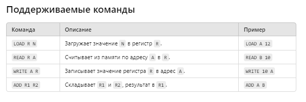

# Учебная Виртуальная Машина (УВМ)

Этот проект предоставляет реализацию **ассемблера** и **интерпретатора** для учебной виртуальной машины (УВМ). УВМ поддерживает базовый набор инструкций для работы с регистрами, памятью и арифметическими операциями.

---

## Особенности

- **Ассемблер**: переводит текстовую программу в бинарный формат.
- **Интерпретатор**: выполняет скомпилированные инструкции и обрабатывает память.
- **Логирование**: ассемблер создаёт лог-файл с подробной информацией об инструкциях.
- **Результаты**: интерпретатор сохраняет выбранный диапазон памяти в CSV.

---

## Пример работы

### Текстовая программа (`program.asm`)
```asm
LOAD A 12
LOAD B 4
ADD A B
WRITE 10 A
```
### Скомпилированный бинарный файл (program.bin)
css
Copy code
```asm
0xEC 0x00 0x0C   # LOAD A 12
0xEC 0x01 0x04   # LOAD B 4
0x1D 0x00 0x01   # ADD A B
0xC2 0x0A 0x00   # WRITE 10 A
```
### Лог-файл (log.csv)
css
Copy code
#### Инструкция,Операнд1,Операнд2
```asm
LOAD,A,12
LOAD,B,4
ADD,A,B
WRITE,10,A
```
### Результат выполнения (result.csv)
Copy code
Адрес,Значение
```asm
10,16
```
## Установка
Склонируйте проект:

bash
Copy code
```bash
cd uvm_project
git clone https://github.com/username/uvm_project.git
```
Убедитесь, что установлен Python 3.6 или выше:

bash
Copy code
```bash
python --version
```
### Использование
Ассемблер
Ассемблер компилирует текстовую программу в бинарный файл и создаёт лог-файл.

bash
Copy code
```bash
python assembler.py <input_file.asm> <output_file.bin> <log_file.csv>
```
## Пример:

bash
Copy code
```bash
python assembler.py program.asm program.bin log.csv
```
Интерпретатор
Интерпретатор выполняет бинарный файл, используя виртуальную машину, и сохраняет содержимое памяти в указанный диапазон.

bash
Copy code
```bash
python interpreter.py <input_file.bin> <output_file.csv> <start_address> <end_address>
```
Пример:

bash
Copy code
```bash
python interpreter.py program.bin result.csv 0 20
```


## Структура проекта
```python
uvm_project/
├── assembler.py        # Ассемблер для преобразования программ
├── interpreter.py      # Интерпретатор для выполнения бинарных файлов
├── program.asm         # Пример текстового файла программы
├── program.bin         # Бинарный файл программы
├── log.csv             # Лог-файл ассемблера
├── result.csv          # Результат работы интерпретатора
├── README.md           # Описание проекта
```

## Тестирование
Для проверки можно использовать следующую программу:

```asm
Copy code
LOAD A 12
LOAD B 4
ADD A B
WRITE 10 A
```
Команды для выполнения:

#### Ассемблирование:
```bash
Copy code
python assembler.py program.asm program.bin log.csv
```
#### Интерпретация:
```bash
Copy code
python interpreter.py program.bin result.csv 0 20
```
#### Ожидаемый результат в result.csv:
```bash
Адрес,Значение
10,16
```